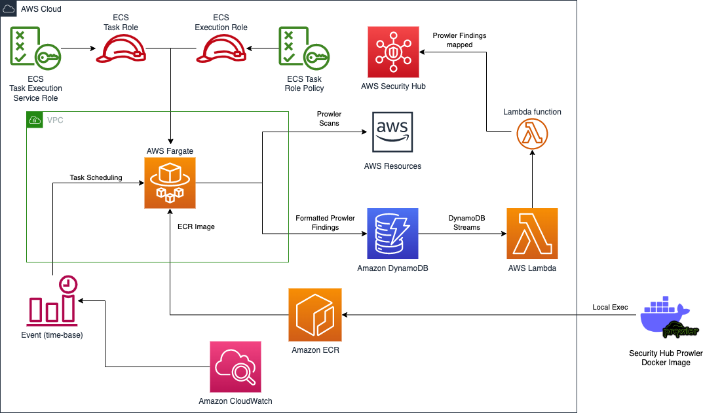

# Security Hub Prowler Integrations on AWS

<p align="center">
	<a href="https://join.slack.com/t/yrisgroupe/shared_invite/zt-1q51z8dmv-GC0XzUSclzBnUQ0tpKhznw"></a>
	<a href="https://github.com/Yris-ops/security-hub-prowler-integrations-aws"></a>
	<a href="https://github.com/Yris-ops/security-hub-prowler-integrations-aws"></a>
	<a href="https://twitter.com/cz_antoine"></a>
	<a href="https://www.linkedin.com/in/antoine-cichowicz-837575b1"></a>
<p>

Use AWS Fargate and Prowler to send AWS Service security configuration findings to Security Hub.

## Solution architecture

The following diagram shows the flow of events in the solution:



Prowler checks are ran from a container running on AWS Fargate which are sent to DynamoDB for persistence.

This repository contains Terraform code for creating an AWS ECR repository and deploying a Docker image with SecurityHub Prowler to an ECS task using Terraform and CloudFormation code creates the supporting infrastructure for the Prowler Fargate AWS Security. 

The template creates an ECS Cluster, Task Definition, and Rule to run Prowler on a scheduled basis. 

The template also creates a DynamoDB table to store the findings and a Lambda function to map the findings into the ASFF before importing them to Security Hub.

## Prerequisites

To use this repository, you need to have the following:

- AWS account with permissions to create resources specified in the code.
- AWS CLI and aws2-wrap installed and configured.
- Terraform and Docker installed on your machine.

## Key Components

This repository contains Terraform and CloudFormation code to deploy SecurityHub Prowler in an Amazon ECS cluster.

The key components are:

- AWS ECR repository: Creates an ECR repository to store the Prowler Docker image.
- Local exec: Builds the Docker image of SecurityHub Prowler, tags it, and pushes it to the ECR repository.
- AWS IAM role: Defines an IAM role to be assumed by ECS tasks.
- AWS IAM policy: Defines the IAM policy to be attached to the ECS task role.
- AWS security group: Creates a security group to allow inbound and outbound HTTPS traffic.
- DynamoDB Table: To store the Prowler findings.
- ECS CloudWatch Logs Group: A CloudWatch log group for the Prowler ECS task logs.
- ECS Cluster: To run the Prowler Fargate task.
- ECS Task Definition: For the Prowler Fargate task.
- Task Scheduler: An EventBridge rule to schedule the Prowler task to run every 7 days.
- Stream Lambda Mapping: A Lambda event source mapping to trigger the ProwlertoSecHubLambdaFunction on DynamoDB stream events.
- Lambda Function: A Lambda function to map Prowler findings into AWS Security Hub format before importing them into Security Hub.
- Lambda Role: An IAM role for the ProwlertoSecHubLambdaFunction to interact with AWS services.

## Configuration

Updating Regions and Configuring `VPC_ID` and `AWS_REGION` Variables for AWS Provider and Prowler Dockerfile.

Open `main.tf` file and navigate to the provider section for `aws`. Update the region value to the desired region where you want to deploy the ECS task.

Define the `vpc_id` variable with the ID of the VPC where you want to deploy the ECS task.

Additionally, open the Dockerfile. Navigate to the `ENV` section. Update the value of the `AWS_REGION` environment variable to the desired region.

Update the region of the `script.sh` file (by default us-west-1) in the prowler folder.

With these configurations in place, you'll be able to deploy your ECS task to a specific VPC in your desired region and run security audits using Prowler in the same region.

## Usage

### Terraform

To use Terraform with AWS, you can follow these steps:

``` bash
aws2-wrap --profile <aws_profile> terraform init
```

``` bash
aws2-wrap --profile <aws_profile> terraform apply --auto-approve
```

Make sure to replace `<aws_profile>` with the name of the AWS profile you want to use for authentication.

After running terraform apply, Terraform will create an ECR repository, build and push the Docker image to the repository, and create an ECS task with the image. You can find the output of the execution in the terminal.

#### Output

The following outputs are generated after executing the Terraform code:

- ecs_execution_role_arn: The ARN of the ECS execution role.
- ecs_execution_role_policy_arn: The ARN of the ECS execution role policy.
- ecs_task_role_arn: The ARN of the ECS task role.
- https_sg_id: The ID of the security group for HTTPS traffic.

Copy the outputs to fill the parameters of the CloudFormation stack.

### CloudFormation

The Prowler Fargate task will run on a scheduled basis according to the AWS Event Rule created by the CloudFormation template. The Prowler findings will be stored in the DynamoDB table created by the template. The Lambda function will map the findings into the ASFF and import them to Security Hub.

``` bash
aws cloudformation create-stack --stack-name prowler-stack --profile <aws_profile> \
  --capabilities CAPABILITY_NAMED_IAM \
  --template-body file://ProwlerToSecurityHub_CloudFormation.yml --parameter-overrides \
  ProwlerClusterName=<Prowler ECS Cluster name> \
  ProwlerContainerInfo=<ECR URI> \
  ProwlerExecutionRole=<Task Execution Role ARN> \
  ProwlerTaskRole=<Task Permissions Role ARN> \
  ProwlerSecurityGroup=<Security Group ID> \
  ProwlerScheduledSubnet1=<Subnet 1 ID> \
  ProwlerScheduledSubnet2=<Subnet 2 ID> \
```

#### Output

The following outputs are generated after executing the CloudFormation code:

- ProwlerReportDynamoDBTable: DynamoDB Table to upload ETLed Prowler findings

## Clean 

To remove the resources created by this Terraform `main.tf`, run the following command:

``` bash
aws2-wrap --profile <aws_profile> terraform destroy --auto-approve
```

To delete the CloudFormation stack and all resources created by the template, run the following AWS CLI command:

``` bash
aws cloudformation delete-stack --stack-name prowler-stack --profile <aws_profile>
```

## Note

You can also use the Docker image directly from the Docker registry by pulling it with the following command:

``` bash
docker pull czantoine/security-hub-prowler-integrations
```

Subsequent checks won't be sent to Security Hub if they are duplicate findings as only New Images are sent to the Stream.

## Useful links

[Docker image](https://hub.docker.com/r/czantoine/security-hub-prowler-integrations)

[Initial AWS Samples Repository](https://github.com/aws-samples/aws-security-hub-prowler-integrations)

[Prowler](https://github.com/prowler-cloud/prowler)

[Security Hub](https://aws.amazon.com/security-hub/)

[ASFF](https://docs.aws.amazon.com/securityhub/latest/userguide/securityhub-findings-format.html)

## Security

See [CONTRIBUTING](CONTRIBUTING.md#security-issue-notifications) for more information.

## License

This repository is licensed under the Apache License 2.0. See the LICENSE file.